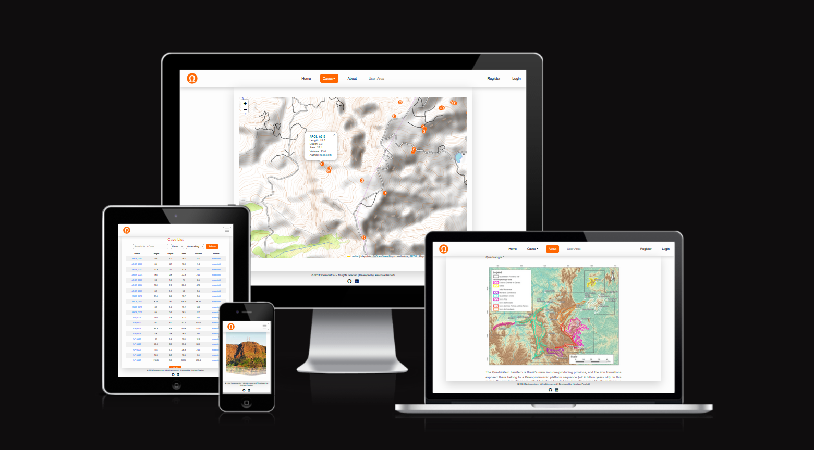

# Speleometrics | a Collaborative Cave Database



[Visit my website here](https://speleometrics-586df55c9a57.herokuapp.com/)

Return back to the [README.md](README.md) file.

## Readme - Table of Contents


[Back to top](https://github.com/hpesciotti/HydroMorpho/blob/main/README.md)

## **4. Technologies Used**

### **4.1. Languages Used**

- [HTML5](https://en.wikipedia.org/wiki/HTML5)

- [CSS3](https://en.wikipedia.org/wiki/Cascading_Style_Sheets)

- [Python](https://www.python.org/about/)

- [JavaScript](https://www.javascript.com/)

[Back to top](https://github.com/hpesciotti/HydroMorpho/blob/main/README.md)

### **4.2 - Frameworks, Libraries, Technologies & Programs Used**  

- [Gitpod](https://www.gitpod.io): used form coding

- [GitHub](https://github.com/): to save and store all files for this web application 

- [Git](https://git-scm.com/): used for version control

- [Django](https://www.djangoproject.com/): for building the web application

- [Regex](https://www.w3schools.com/python/python_regex.asp): for checking for pattern in strings.

- [Google Fonts](https://fonts.google.com/): font was imported from here 

- [Font Awesome](https://fontawesome.com/): icons and their associated kit were downloaded from here  

- [Leaflet](https://leafletjs.com/examples.html): an open-source JavaScript library for mobile-friendly interactive maps, especially the tutorials section on how to how to add a marker and set custom style for the marker.

- [Numpy](https://numpy.org/): for running the statistics

- [Cloudinary](https://cloudinary.com/): for storing images (cave-maps and profile pictures)

- [Microsoft Power Point](https://www.lucidchart.com/pages/?): used to create data chart and logo

- [ChatGPT](https://chat.openai.com/): for improving and making text content more engaging.

- [ArcGIS](https://www.arcgis.com/index.html): to build the QF geomorphological units map.

- [Grammarly](https://app.grammarly.com): for spelling or grammatical inaccuracies in the text

- [Google Chrome Lighthouse](https://chromewebstore.google.com/detail/lighthouse/blipmdconlkpinefehnmjammfjpmpbjk): for auditing the performance of the web application

- [Code Institute Linter](https://pep8ci.herokuapp.com/#): for validating Python code according PEP 8

- [MS Paint](https://www.microsoft.com/en-us/windows/paint): for editing the captured screenshots

- [Heroku](https://dashboard.heroku.com/): for deploying the terminal application.

[Back to top](//github.com/hpesciotti/Speleometrics/blob/main/README.md)

## **5. Testing**

- An additional file for Testing can be found here: [Testing](https://github.com/hpesciotti/Speleometrics/blob/main/TESTING.md)

## **6. Deployment**

The website was developed using Gitpod code editor, committed to Git as a local repository, and then pushed to GitHub for storage.

## **6.1 Code Institute PostgreSQL Database *

- Navigate to [Code Institute PostgreSQL Database](https://dbs.ci-dbs.net/)
- Enter your student email address in the input field provided.
- Wait for database to be created and review the email sent to your student email inbox.

[Back to top](//github.com/hpesciotti/Speleometrics/blob/main/README.md)

### **6.2. Connecting to GitHub**

To begin this project from scratch, you must first create a new GitHub repository using the [Code Institute's Template](https://github.com/Code-Institute-Org/ci-full-template). This template provides the relevant tools to get you started. To use this template:

1. Log in to [GitHub](https://github.com/) or create a new account.
2. Navigate to the above CI Full Template.
3. Click '**Use this template**' -> '**Create a new repository**'.
4. Choose a new repository name and click '**Create repository from template**'.
5. In Gitpod locate your repository and create a new workspace.

[Back to top](//github.com/hpesciotti/Speleometrics/blob/main/README.md)

### **6.3. Django Project Setup**

- Install Django and all supporting libraries for Speleometrics: 

```
pip install asgiref==3.8.1
pip install cloudinary==1.36.0
pip install dj-database-url==0.5.0
pip install dj3-cloudinary-storage==0.0.6
pip install Django==4.2.16
pip install django-allauth==0.57.2
pip install django-resized==1.0.2
pip install django-summernote==0.8.20.0
pip install gunicorn==20.1.0
pip install numpy==2.1.2
pip install oauthlib==3.2.2
pip install pillow==10.4.0
pip install psycopg2==2.9.9
pip install PyJWT==2.9.0
pip install python3-openid==3.2.0
pip install requests-oauthlib==2.0.0
pip install sqlparse==0.5.1
pip install urllib3==1.26.20
pip install whitenoise==5.3.0
```
  
- After the insatalation process run ```pip3 freeze --local > requirements.txt``` in the terminal.  
- Create a new Django project in the terminal ```django-admin startproject speleometrics .```
- Create a new app eg. ```python3 mangage.py startapp caves```
- Register caves in **INSTALLED_APPS** in **settings.py** as 'caves',
- Run ```python3 manage.py createsuperuser``` and enter credentials to create a superuser, allowing Admin access.
- Run migrations with commands: ```python3 manage.py makemigrations``` and ```python3 manage.py migrate```
- Create an **env.py** to store all confidential data such as the **DATABASE_URL** and **SECRET_KEY**. 

```import os
os.environ["DATABASE_URL"]="<CI's data base>"
os.environ.setdefault("CLOUDINARY_URL")
```

- Add envy.py to must be added to your **gitignore**, so it will not be upload to GitHub.
- Reference the file in your project's **settings.py**: 
For adding to **settings.py**:

```
import os
import dj_database_url
if os.path.exists("env.py"):
import env
```

- Replace **DATABASES** with:

```
DATABASES = {
    'default': dj_database_url.parse(os.environ.get("DATABASE_URL"))
  }
```

- Set up the templates directory in **settings.py**:
    Under ``BASE_DIR`` enter ``TEMPLATES_DIR = os.path.join(BASE_DIR, ‘templates’)``
    Update ``TEMPLATES = 'DIRS': [TEMPLATES_DIR]`` with:

```
os.path.join(BASE_DIR, 'templates'),
os.path.join(BASE_DIR, 'templates', 'allauth')
```

- Create the media, static and templates directories in top level of project file in IDE workspace.

-  Create a Procfile in the project repository for Heroku deployment, containing the following line:
web: gunicorn speleometrics.wsgi

-  Run migrations again to ensure all database changes are applied.

[Back to top](//github.com/hpesciotti/Speleometrics/blob/main/README.md)

### **6.4. Cloudinary API**

Cloudinary offers a cloud-based solution for media storage. All images uploaded by users in the Speleometrics project are hosted on this platform.

To get started, create a new account at Cloudinary and add your Cloudinary API environment variable to your env.py file and Heroku Config Vars. In your project workspace:
  - Include the Cloudinary libraries in the INSTALLED_APPS section of your settings.py file, in the following order:
```
   'cloudinary_storage',  
   'django.contrib.staticfiles',  
   'cloudinary',
```
- Add to **env.py** and link up with **settings.py**: ```os.environ["CLOUDINARY_URL"]="cloudinary://...."``` 
- Configure Cloudinary as the storage for media and static files in settings.py with the following settings:

```
STATIC_URL = '/static/
STATICFILES_STORAGE = 'cloudinary_storage.storage.StaticHashedCloudinaryStorage'  
STATICFILES_DIRS = [os.path.join(BASE_DIR, 'static'), ]  
STATIC_ROOT = os.path.join(BASE_DIR, 'staticfiles')‌  
MEDIA_URL = '/media/'  
DEFAULT_FILE_STORAGE = 'cloudinary_storage.storage.MediaCloudinaryStorage'
```
[Back to top](//github.com/hpesciotti/Speleometrics/blob/main/README.md)

### **6.5.  Heroku Deployment**

To start the deployment process , please follow the below steps:

- Log in to [Heroku](https://id.heroku.com/login) or create an account if you are a new user.
- Once logged in, in the Heroku Dashboard, navigate to the '**New**' button in the top, right corner, and select '**Create New App**'.
- Enter an app name and choose your region. Click '**Create App**'. 
-  In the Deploy tab, click on the '**Settings**', reach the '**Config Vars**' section and click on '**Reveal Config Vars**'. Here you will enter KEY:VALUE pairs for the app to run successfully. The KEY:VALUE pairs that you will need are your: 
   
   - Set CLOUDINARY_URL** 
   - Set DATABASE_URL**
   - Set DISABLE_COLLECTSTATIC to 1
  
- Add the Heroku host name into **ALLOWED_HOSTS** in your projects **settings.py file** -> ```['herokuappname', ‘localhost’, ‘8000 port url’].```
- Once you are sure that you have set up the required files including your requirements.txt and Procfile, you have ensured that **DEBUG=False**, save your project, add the files, commit for initial deployment and push the data to GitHub.
- Go to the '**Deploy**' tab and choose GitHub as the Deployment method.
- Search for the repository name, select the branch that you would like to build from, and connect it via the '**Connect**' button.
-  Choose from '**Automatic**' or '**Manual**' deployment options, I chose the 'Manual' deployment method. Click '**Deploy Branch**'.
- Once the waiting period for the app to build has finished, click the '**View**' link to bring you to your newly deployed site. If you receive any errors, Heroku will display a reason in the app build log for you to investigate. *

[Back to top](//github.com/hpesciotti/Speleometrics/blob/main/README.md)

### **6.5.  Clone Project**

A local clone of this repository can be made on GitHub. Please follow the below steps:

- Navigate to GitHub and log in.
- The [Speleometrics](https://github.com/hpesciotti/Speleometrics/) can be found at this location.
- Above the repository file section, locate the '**Code**' button.
- Click on this button and choose your clone method from HTTPS, SSH or GitHub CLI, copy the URL to your clipboard by clicking the '**Copy**' button.
- Open your Git Bash Terminal.
- Change the current working directory to the location you want the cloned directory to be made.
- Type `git clone` and paste in the copied URL from step 4.
- Press '**Enter**' for the local clone to be created.
- Using the ``pip3 install -r requirements.txt`` command, the dependencies and libraries needed for FreeFido will be installed.
- Set up your **env.py** file and from the above steps for Cloudinary and ElephantSQL, gather the Cloudinary API key and the Elephant SQL url for additon to your code.
- Ensure that your **env.py** file is placed in your **.gitignore** file and follow the remaining steps in the above Django Project Setup section before pushing your code to GitHub.

[Back to top](//github.com/hpesciotti/Speleometrics/blob/main/README.md)

### **6.6.  Clone Project**

A copy of the original repository can be made through GitHub. Please follow the below steps to fork this repository:  

- Navigate to GitHub and log in.  
- Once logged in, navigate to this repository using this link [Speleometrics](https://github.com/hpesciotti/Speleometrics/).
- Above the repository file section and to the top, right of the page is the '**Fork**' button, click on this to make a fork of this repository.
- You should now have access to a forked copy of this repository in your Github account.
- Follow the above Django Project Steps if you wish to work on the project.

[Back to top](//github.com/hpesciotti/Speleometrics/blob/main/README.md)

## **7. Credits**

### **7.1. Content**

- Code Institute - I think there for I Blog project: Django walkthrough project.

- [RegexTutorial](https://www.regextutorial.org/positive-and-negative-lookahead-assertions.php): reading material on negative and positive lookahead assertions

- [W3Schools](https://www.w3schools.com/python/python_regex.asp): for Regex reading material.

- [Regex Calculator](https://regex101.com/): for testing and implementing Regex

- [Django Docs](https://docs.djangoproject.com/en/dev/ref/contrib/admin/#django.contrib.admin.ModelAdmin.readonly_fields): For general info on Django functionalites

- [Leaflet](https://leafletjs.com/examples.html): an open-source JavaScript library for mobile-friendly interactive maps, especially the tutorials section on how to how to add a marker and set custom style for the marker.

- [D3noob GitHub page](https://gist.github.com/d3noob/9150014): how to add multiple points to leaflet div's map.

- [Leaflet Basemap Previw](https://leaflet-extras.github.io/leaflet-providers/preview/): To pick a basemap for cave_maps page.

- [Geographic Information Systems](https://gis.stackexchange.com/questions/184125/alternative-basemaps-for-leaflet): for info on alternative basemaps for Leaflet.

- [appsbd](https://appsbd.com/how-to-create-map-using-leaflet-js-best-way-to-figure/): On how to add pop-ups to Leaflet.

- [Stack Overflow](https://stackoverflow.com/questions/63962443/create-a-post-save-signal-that-creates-a-profile-object-for-me): Creating post signals.

- [Stack Overflow](https://stackoverflow.com/questions/14820952/change-bootstrap-input-focus-blue-glow): Changing glow default glow effects on bootstrap.

- [Stack Overflow](https://stackoverflow.com/questions/7168658/why-is-the-padding-not-working-on-my-label-elements): Setting padding to input fields.

- [Stack Overflow](https://stackoverflow.com/questions/8806673/html-how-to-retain-formatting-in-textarea): on how to retain formatting o text area.

- [Boostrap Docs](https://getbootstrap.com/docs/5.3/getting-started/introduction/): Implementing nav bar, accordion, focus, hover effects, grid structure and more.

- [Amy Richardson](https://github.com/amylour/FreeFido_v2): for post signals and general django structure.

- [Joy Zadan](https://github.com/JoyZadan/shop-kbeauty): Implementing search bar and filters.

- [StaticsGlobe](https://www.youtube.com/watch?v=VZAmgg_khO0): How to calculate percentiles with num.py

[Back to top](//github.com/hpesciotti/Speleometrics/blob/main/README.md)

### **7.2. Media**

- [Font Awesome](https://fontawesome.com/): for the icons used in the footer of the application.

- [Unplash](https://unsplash.com/pt-br/s/fotografias/Serra-do-Curral): for index hero image

- All remaining photographs are my own.

[Back to top](//github.com/hpesciotti/Speleometrics/blob/main/README.md)

### **7.4. Acknowlegements**

- My informal mentor and great friend, [Bruno Dias](https://github.com/brunoald/), for helping me to structure the project.

- My mentor, Darío Carrasquel, for his support and constructive feedback.

- My partner, Joana, for all the emotional support.

[Back to top](//github.com/hpesciotti/Speleometrics/blob/main/README.md)
